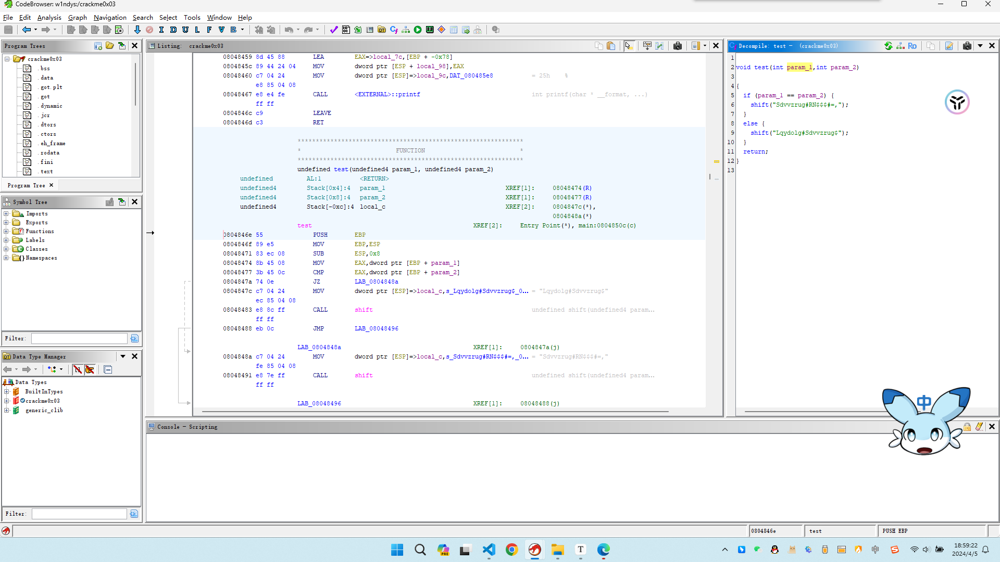

# 汇编语言与逆向工程实验报告 6

## 环境安装



## crackme02 逆向

```c
undefined4 main(void)
{
    int local_8;

    printf("IOLI Crackme Level 0x02\n");
    printf("Password: ");
    scanf("%d", &local_8);
    if (local_8 == 0x52b24)
    {
        printf("Password OK :)\n");
    }
    else
    {
        printf("Invalid Password!\n");
    }
    return 0;
}
```

通过分析伪代码得

首先输出两句话，输入密码

然后 if 判断，如果输入的内容与十六进制数 `0x52b24` 相等，则输出`Password OK`，否则输出 `Invalid Password!`

所以密码就是`0x52b24`

十六进制数为：`0x52b24`

转换为二进制为：`0b1010010101100100100`

转换为八进制为：`0o1225444`

转换为十进制为：`338724`

## crackme03 逆向

### 主函数伪代码

```c
undefined4 main(void)

{
  undefined4 local_8;

  printf("IOLI Crackme Level 0x03\n");
  printf("Password: ");
  scanf("%d",&local_8);
  test(local_8,0x52b24);
  return 0;
}
```

### test 伪代码

```c
void test(int param_1,int param_2)

{
  if (param_1 == param_2) {
    shift("Sdvvzrug#RN$$$#=,");
  }
  else {
    shift("Lqydolg#Sdvvzrug$");
  }
  return;
}

```

### shift1 伪代码

```c title="shift1 伪代码"
void shift(char *param_1)

{
  size_t sVar1;
  uint local_80;
  char local_7c [120];

  local_80 = 0;
  while( true ) {
    sVar1 = strlen(param_1);
    if (sVar1 <= local_80) break;
    local_7c[local_80] = param_1[local_80] + -3;
    local_80 = local_80 + 1;
  }
  local_7c[local_80] = '\0';
  printf("%s\n",local_7c);
  return;
}
```

### shift2 伪代码

```c title="shift2 伪代码"
void shift(char *param_1)

{
  size_t sVar1;
  uint local_80;
  char local_7c [120];

  local_80 = 0;
  while( true ) {
    sVar1 = strlen(param_1);
    if (sVar1 <= local_80) break;
    local_7c[local_80] = param_1[local_80] + -3;
    local_80 = local_80 + 1;
  }
  local_7c[local_80] = '\0';
  printf("%s\n",local_7c);
  return;
}
```

通过分析伪代码,主函数接受用户输入一个数，然后进入 test 函数，参数是输入的数和另一个十六进制数

十六进制数为：0x52b24
转换为二进制为：0b1010010101100100100
转换为八进制为：0o1225444
转换为十进制为：338724

进入 test 函数之后可以看到如果两个参数相等，则调用函数第一个`shift1`，否则调用函数第二个`shift2`

shift1 函数携带参数为字符串`Sdvvzrug#RN$$$#=,`，shift2 函数携带参数为字符串`Lqydolg#Sdvvzrug$`

shift1 函数的作用是将传入的字符串中的每个字符的 ASCII 码值减去 3，然后将结果打印出来。

shift2 函数的作用同上

编写脚本解密

```python
a="Sdvvzrug#RN$$$#=,"
aa=""
b="Lqydolg#Sdvvzrug$"
bb=""
for i in range(len(a)):
    aa+=chr(ord(a[i])-3)
    bb+=chr(ord(b[i])-3)
print(aa)
print(bb)
```

解密结果是
Password OK!!! :)
Invalid Password!

> I_have_g0t_it_n0w!
