# 标准 IP 访问控制列表配置

## 实验目标

1. 理解标准 IP 访问控制列表的原理及功能

2. 掌握编号的标准 IP 访问控制列表的配置方法

## 实验背景

### 网络配置要求

公司的经理部、财务部和销售部门分属于不同的 3 个网段。三部门之间使用路由器进行信息传递。为了安全起见，公司领导要求以下访问控制：

- 销售部门不能对财务部进行访问。
- 经理部可以对财务部进行访问。

### 部门主机代表

- PC1: 经理部的主机
- PC2: 销售部的主机
- PC3: 财务部的主机

## 技术原理

### 接入控制列表 (Access Control Lists, ACLs)

接入控制列表（ACLs），也称访问控制列表（Access Lists），俗称防火墙，在有的文档中还称包过滤。ACLs 通过定义一些规则对网络设备接口上的数据包进行控制，允许通过或丢弃，从而提高网络可管理性和安全性。

### IP ACL 分类

IP ACL 分为两种：标准 IP 访问列表和扩展 IP 访问列表。

- 标准 IP 访问列表：编号范围为 1～99、1300～1999。可以根据数据包的源 IP 地址定义规则，进行数据包的过滤。
- 扩展 IP 访问列表：编号范围为 100～199、2000～2699。可以根据数据包的原 IP、目的 IP、源端口、目的端口、协议来定义规则，进行数据包的过滤。

### IP ACL 应用

IP ACL 基于接口进行规则的应用，分为入栈应用和出栈应用。

## 实验步骤

### 完成拓扑图的搭建

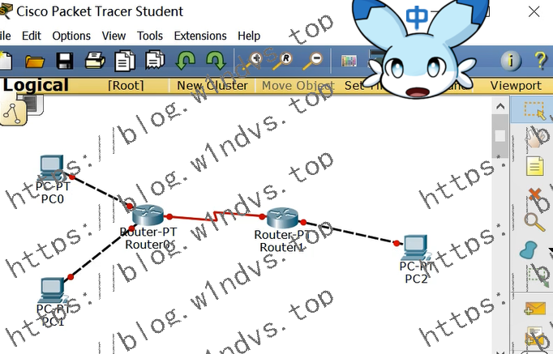

### 配置 IP 地址

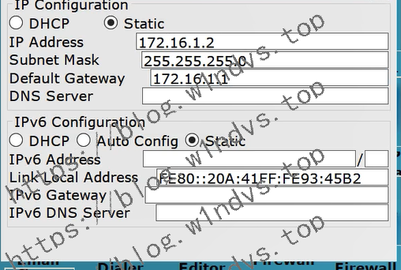

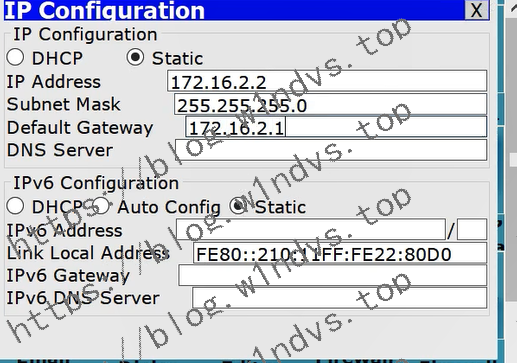

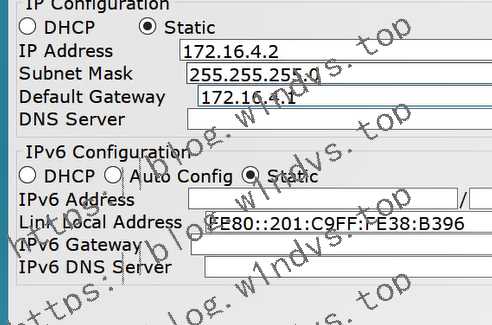

### 配置 router0 联通的端口

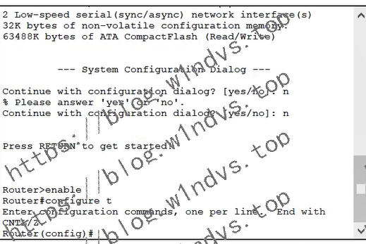

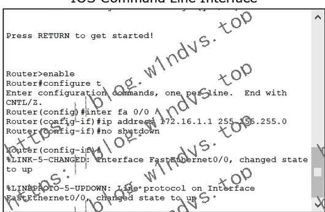

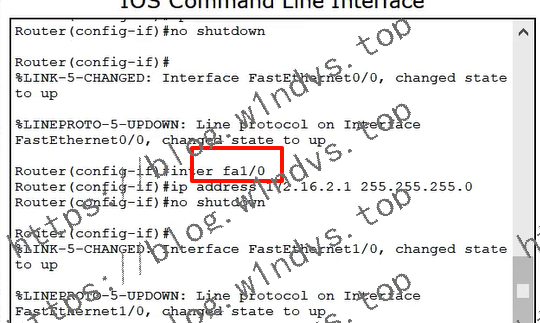

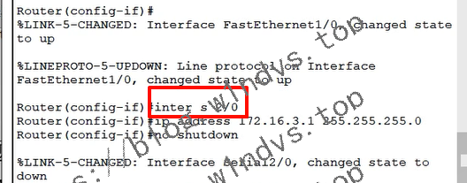

### 配置 router1 联通的端口

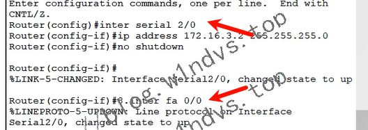

### 配置 router0 的路由 IP 转发表

### 配置 router1 的路由 IP 转发表

### PC0 ping 目标主机

### PC1 ping 目标主机

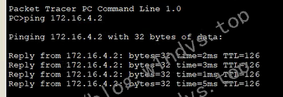

### 配置 router0 的 IP 准入

### PC0 ping 主机

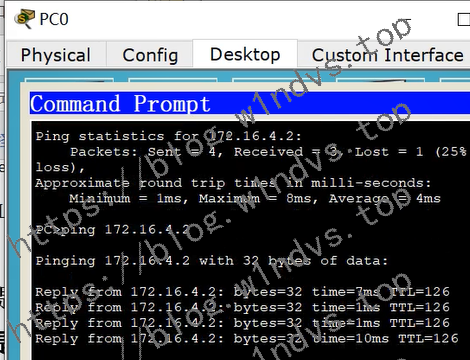

### PC1 ping 主机

